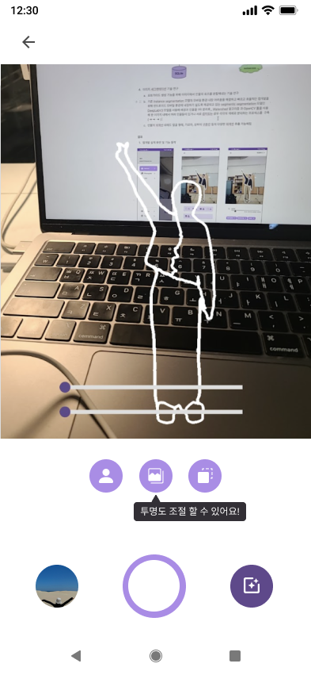
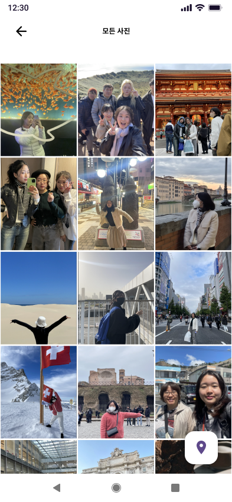
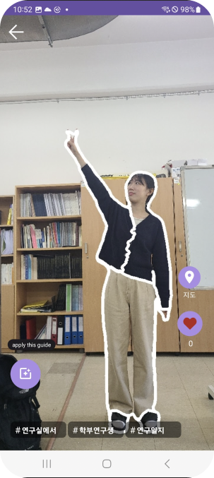
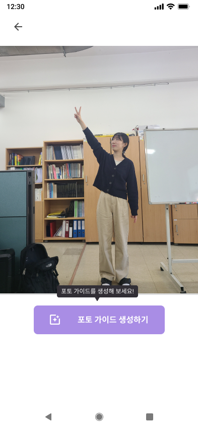
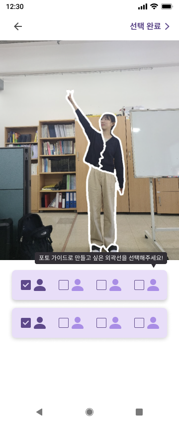
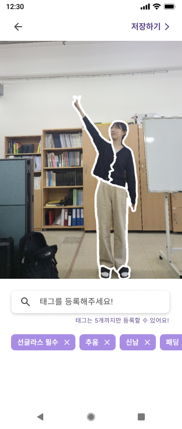

# Phodo-Android
<div align=Left>


</div>

> 위치별 인생샷 도우미 카메라 앱, 나만의 포토가이드를 만들고 공유할 수 있는 커뮤니티 기반 카메라 서비스

## 📱 ScreenShot
| | | | | | |
| -------- | -------- | -------- | -------- | -------- | -------- |
|  |  | | || |


## 🗺️ Information

### Image Segmentation
이미지에 사람 객체에 대한 외곽선을 추출하기 위해 세그멘테이션 기술을 도입하였습니다.  <br>
개별 인물 각각의 고유한 외곽선이 필요했기 때문에 instance segmentation 기술이 필요했지만 <br>
안드로이드 모바일 환경에 내장하여 바로 활용할 수 있는 오픈소스 모델이 없다고 판단했고 이 과정에서 많은 연구와 시도가 있었습니다. <br>

[구현방법] <br>
pytorch 에서 제공하는 sementic segmentation 모델을 사용하여 모든 인물에 대한 외곽선을 1차 추출하고 <br>
opencv의 watershed 알고리즘을 사용해 인물을 각각 구별해내는 후처리를 통해 2차 추출을 진행하는 방식으로 목표를 달성했습니다.  <br>

[관련 실적]
* 해당 연구 내용을 논문으로 작성하여 정보기술학회에서 발표해 금상 수상  <br>
[논문](segmentation/김경민_정보기술학회_2023_final.pdf)<br>
[수상내역](segmentation/정보기술학회.jpeg)<br>

<br>


### MVVM + AAC ViewModel
MVVM 패턴을 적용하기 위해 AAC ViewModel을 활용하는 방식을 시도했으나 구현방법과 개념을 완전히 숙지하지 못하여 제대로 구현하지 못하였습니다. <br>
하지만 시행착오 과정에서 MVVM 패턴과 AAC ViewModel의 관계에 대해 자세히 공부할 수 있었던 좋은 계기였다고 생각합니다.<br>


[관련 실적] <br>
* 기술블로그 스터디 내용 정리 <br>
[MVC, MVVM 패턴 그리고 ViewModel](https://studyroadmap-kkm.tistory.com/168) <br>
[AAC ViewModel 사용하기](https://studyroadmap-kkm.tistory.com/169)
<br>


### Features
0. 구글 로그인
1. 마이페이지 조회
2. 사진 촬영하기
3. 앨범 조회하기
4. 포토가이드 둘러보기
5. 포토가이드 적용하기
6. 포토맵 둘러보기
7. 포토가이드 만들기
8. 포토스팟별 포토가이드 조회하기

### Technology Stack
* Tools : Android Studio Dolphin
* Language : Kotlin
* Architecture Pattern : Repository Pattern
* Android Architecture Components(AAC)
* ViewModel
* Naivgation Conponponent
* OKHTTP
* RETROFIT
* SERIALIZATION
* Google Oauth2.0
* KAKAO Map
* OpenCV
* Picasso


## Foldering
```
.
├── base
├── data
│   ├── RemoteDataSource
│   └── RemoteDataSourceImp
├── Repository
│   ├── NetworkModule
│   └── RepositoryModule
├── dto
├── Home
│   ├── camera (for navigation component)
│   ├── gallery (for navigation component)
│   ├── slideshow (for navigation component)
│   ├── HomeActivity
│   └── HomeViewModel
├── PhotoGuide
├── PhotoMap
├── PhotoMaker
├── utils
│   └── PreferenceUtil
├── ApiService
├── ViewModelFactory
└── RetrofitInstance

```

## ToDO
* yolov5 모델 연결하기
* 구글 로그인 jwt 완성하기
* 포토스팟 마커 모듈화 하기
* 아키텍쳐 수정하기
* 모델 성능 개선하기 (실행 속도 개선)
